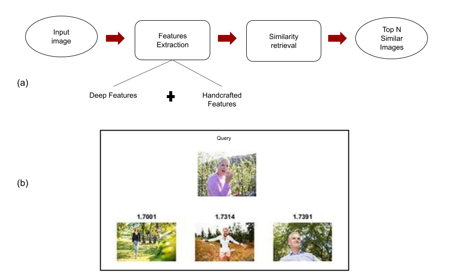

# deep-features-extraction
Editorial Image Retrieval using Handcrafted and CNN Features

Users of this software are encouraged to cite the following article: Companioni-Brito, C., Elawady, M., Yildirim, S., Hardeberg, J.Y. (2018). Editorial Image Retrieval Using Handcrafted and CNN Features. In: Mansouri, A., El Moataz, A., Nouboud, F., Mammass, D. (eds) Image and Signal Processing. ICISP 2018. Lecture Notes in Computer Science(), vol 10884. Springer, Cham. https://doi.org/10.1007/978-3-319-94211-7_31
